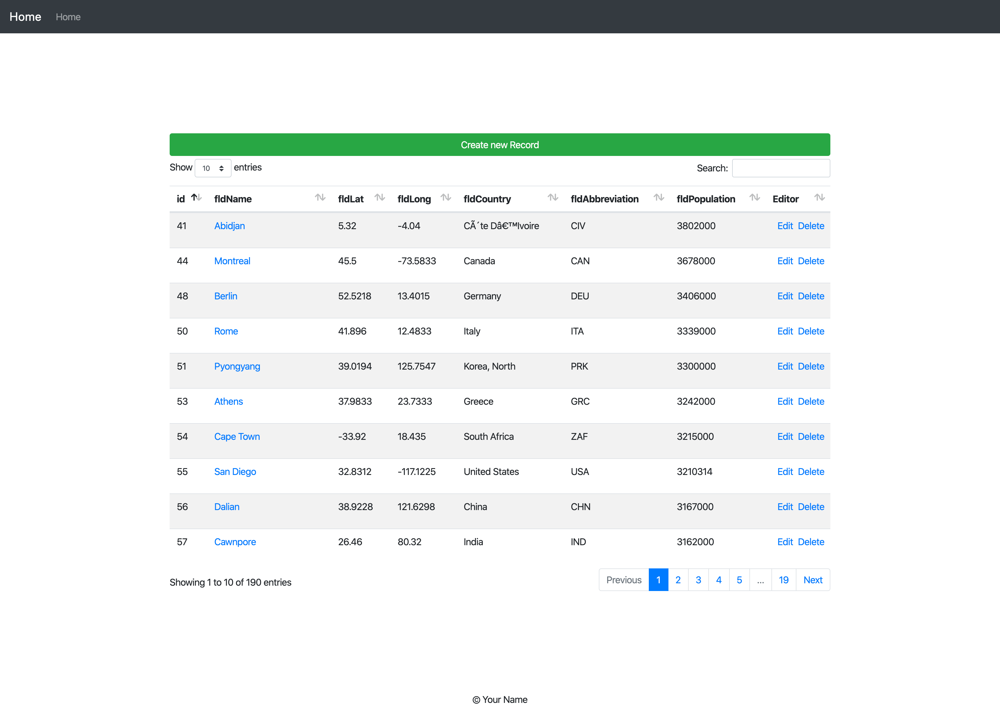

# API Introduction and Setup an API Server with MySQL and Express

## Overview

A simple  express CRUD app using Jquery

|Routes|  |
|--|--|
|  /|  index|
|  /new|  create a new city|
|  / [post]| post a new city |
|  /:id| show a city with id|
|  /edit/:id| edit a city with id|
|  /edit/:id [put]| put a city with id|
|/:id [delete]| delete a city with id |

# INDEX Route

# Create Route

# Edit Route

## Project Setup Instructions

1. Clone the repo
2. Switch to assignment 3 branch
3. Run npm install
4. Setup docker in WebStorm
5. Right click the docker-compose.yml file and run it from the project explorer
6. Setup Gulp in WebStorm
