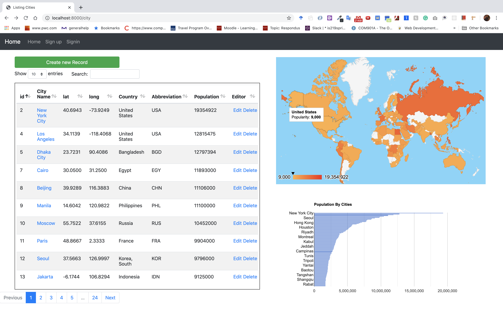
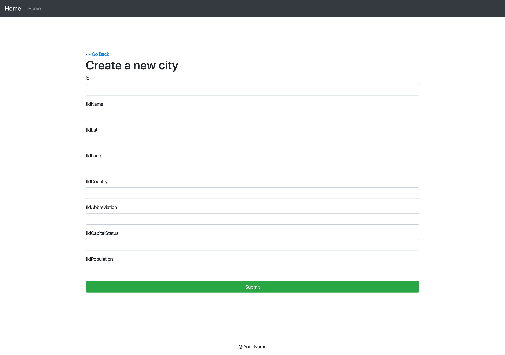
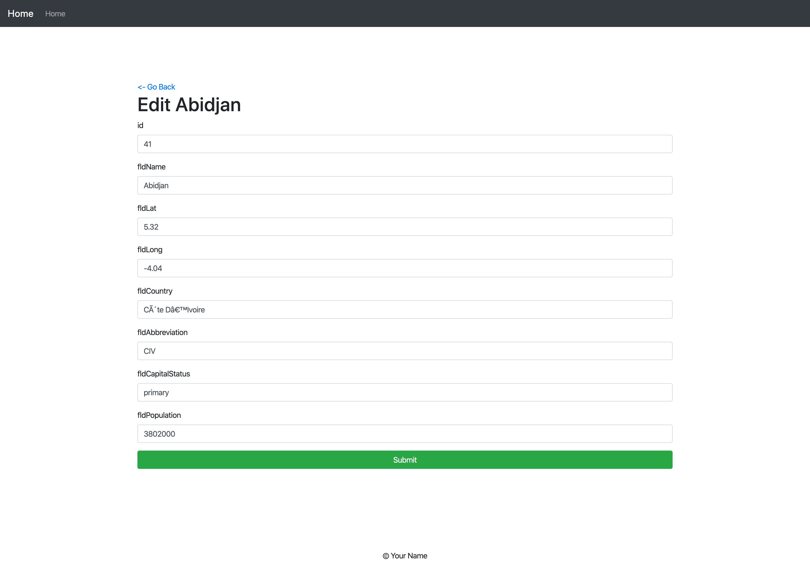
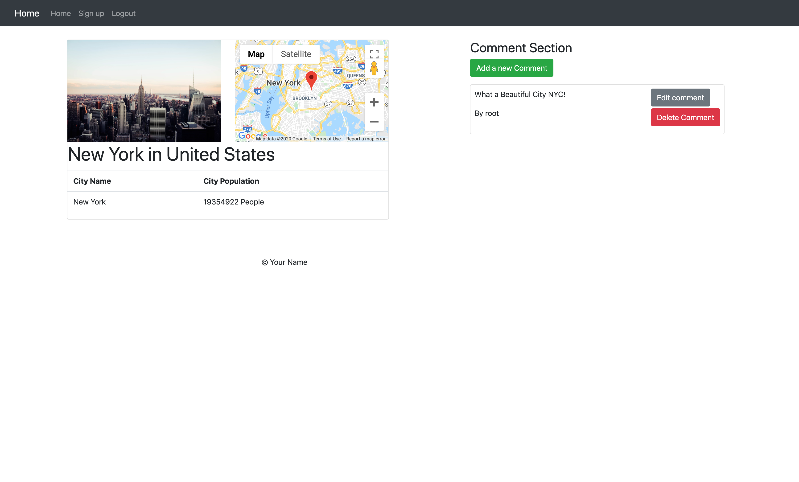

# A simple  express CRUD app using Jquery

## Overview

A simple  express CRUD app using Jquery


# Simple NodeJs CRUD Project with Authenication
## INDEX Route


## Create Route


## Edit Route



## show Route



## sign in Route

### Thing to do before start this project
1. Things to run in command
```
git clone
npm install
docker-compose up
```
2. Go to Google Console and get a APi
[GOOGLE API KEY LINK](https://developers.google.com/maps/documentation/javascript/get-api-key)
3. Go to Upsplash and Get Upsplash API
[Upsplash Link](https://unsplash.com/documentation#creating-a-developer-account)
4. paste them here
```javascript
//~/src/public/js/API_KEY.js
const GOOGLE_API_KEY = 'YOUR_API_KEY';
const UPSPLASH_API_KEY = 'YOUR_API_KEY';
```
5. To start
```
npm run dev
```

### Main Technologies used:
1. NodeJS
2. MySQL
3. Sequelize (ORM)
4. Passport.js (Authentication Library)
5. Datatable
6. Ajax
7. Pug
8. Express.js
9. Google API

# BackEnd
This project shows how to implement create, edit, delete, show functionality. The app has two data models:

1. User (id, name, username, password, email, phone)
2. City (id,cityName,lat,lng,Country, abbreviation,captial,population)

The app uses express to connect the api endpoint to the data models as shown below. 
## City Routes


### Create Route
```javascript
// render create new route
router.get("/new", isLoggedin, cityController.new);

// create post route
router.post("/",isLoggedin, cityController.new_post);
```
### Show Route
```javascript
router.get("/:id",cityController.show);
```

### Edit Route
```javascript
// edit page
router.get("/edit/:id", checkOwnship, cityController.edit);

router.put("/edit/:id", checkOwnship,cityController.edit_put);
```
### Delete Route
```javascript
router.delete("/:id", checkOwnship, cityController.delete);
```
## User Route
### Signup Route
```javascript
// register
router.get("/register",getSignUpPage);
// sign up
router.post('/signup',passport.authenticate('local-signup', {
    successRedirect: '/',
    failureRedirect: '/register'
}), signUp);
```
### Sign in Route
```javascript
// get sign in page
router.get("/signin",getSignInPage);
// sign in
router.post("/signin",
    passport.authenticate('local-signin',{
        successRedirect: '/city',
        failureRedirect: '/signin',
        failureFlash: 'Invalid username or password.',
    }), signIn
);

```
### Sign out Route
```javascript
// log out
router.get("/logout",logOut);
```

Users often have personalized information and need specific authorization to make certain request. Thus, implementation of authenication is neccessary. This project use passport.js which is an authenication middleware library. This allows it to intercept the request, establish session and authenicate user
here is the implementation

```javascript
// sign-up implementation 
passport.use("local-signup",new LocalStrategy(
// overriding default username and password email and password
    {
    usernameField : 'email',
    passwordField : 'password',
    passReqToCallback : true
    },
    function(req, email, password, done){
        process.nextTick(function() {
            User.findOne({where:{email: email}}).then((user) =>{
                if(user){
                    // user already exist
                    return done(null, false,{message:"user already exist"});
                }
                else{
                	// user doesn't exist
                    // hashed users password
                    // stored user  information into database
                    // continue the request 
                   let hashedpassword = User.hashPassword(password);
                    let {name, phone , username} = req.body;
                    let data = {
                        email:email,
                        password: hashedpassword,
                        name: name,
                        username:username,
                        phone:phone
                    };
                    //create user into the database
                    User.create(data).then(function(newUser, created){
                        if (!newUser) {
                            return done(null, false);
                        }
                        if (newUser) {
                            return done(null, newUser);
                        }
                    })
                }
                }
            )
        })
    }
)
);


passport.use('local-signin',
// overriding default username and password email and password
    new LocalStrategy({
        // by default, local strategy uses username and password, we will override with email
        usernameField: 'email',
        passwordField: 'password',
        passReqToCallback: true // allows us to pass back the entire request to the callback
    },
    function(req, email, password, done) {
    // find the user in the database 
        User.findOne({
            where: {
                email: email
            }
        }).then(function(user) {
        // user doesn't exist
            if (!user) {
                return done(null, false, {
                    message: 'Email does not exist'
                });
            }
            // user password is not correct
            if (!User.validPassword(password, user.password)) {
                req.flash('errors','User enter the wrong password');
                return done(null, false, {
                    message: 'Incorrect password.'
                });
            }
            // success login
           	// flash message
            req.flash('success', " successfully login");
            return done(null, user, {message:"successfully"});
        }).catch(function(err) {
            console.log("Error:", err);
            return done(null, false, {
                message: req.flash("error","something wrong with login in")
            });
        });
    }
    ));


passport.serializeUser(function(user, done) {
// save user session
    done(null, user.id);
});

passport.deserializeUser(function(id, done) {
// read user from session
    User.findByPk(id).then(function(user) {
        if (user) {
            done(null, user.get());

        } else {
            done(user.errors, null);
        }
    });
});

```
Implementing Passport js in Routing 
```javascript
 // sign in
router.post("/signin",
    passport.authenticate('local-signin',{
    	// successfully signin redirect to city index page
        successRedirect: '/city',
        // failure to login redirect to sign in page
        failureRedirect: '/signin',
        failureFlash: 'Invalid username or password.',
    }), signIn
);
```
check if user login?
```javascript
exports.isLoggedin = function (req, res, next) {
    if(req.isAuthenticated()){
       return next();
    }
    res.redirect("/signin")
};
```
check if user have authorization
```javascript
exports.checkOwnship = function(req,res, next){
    if(req.isAuthenticated()){
        City.findByPk(req.params.id).then((city) => {
            if(city.getDataValue('UserID') == res.locals.currentUser.id){
                return next();
            }
            else{
                req.flash("errors", "You don't have permission to do that");
                res.redirect('back')
            }
        })
    }
    else{
        res.redirect("/signin")
    }
};
```
# FrontEnd
The frontend uses Jquery to manunipate DOMS. The chart is render by Google Chart Api. The show page also uses google map api to render the location of city. It also uses uplash api to render picture of city.


